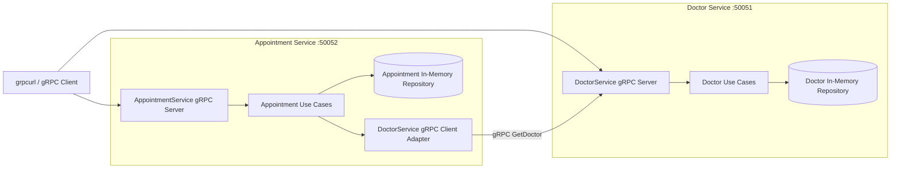

# AP2 Assignment 2 - gRPC Migration

## Project Overview

This project migrates the Medical Scheduling Platform from REST to gRPC while preserving Clean Architecture and bounded contexts.

- `doctor-service`: owns doctor data and exposes Doctor gRPC APIs.
- `appointment-service`: owns appointment data, exposes Appointment gRPC APIs, and validates doctors by calling Doctor Service over gRPC.

All client-to-service and inter-service communication is gRPC only.

## Architecture And Data Ownership

Clean Architecture inside each service:

- `internal/model`: domain entities (`Doctor`, `Appointment`, `Status`)
- `internal/usecase`: business rules + interfaces
- `internal/repository`: storage implementations
- `internal/client` (appointment only): outbound gRPC client adapter
- `internal/transport/grpc`: thin gRPC delivery handlers
- `internal/app`: dependency wiring and gRPC server startup

Dependency direction:

`transport/grpc -> usecase -> repository/interface -> model`

Use cases never import protobuf-generated types. Mapping between domain objects and protobuf messages is handled in the gRPC delivery layer.

## Updated Architecture Diagram



## Proto Contracts

Owned contracts:

- `doctor-service/proto/doctor.proto`
- `appointment-service/proto/appointment.proto`

Generated stubs are committed:

- `doctor-service/proto/doctor.pb.go`
- `doctor-service/proto/doctor_grpc.pb.go`
- `appointment-service/proto/appointment.pb.go`
- `appointment-service/proto/appointment_grpc.pb.go`

### DoctorService RPCs

- `CreateDoctor(CreateDoctorRequest) returns (DoctorResponse)`  
  Rule: `full_name` and `email` required, email must be unique.
- `GetDoctor(GetDoctorRequest) returns (DoctorResponse)`  
  Rule: return `NOT_FOUND` when ID does not exist.
- `ListDoctors(ListDoctorsRequest) returns (ListDoctorsResponse)`  
  Rule: return all stored doctors.

### AppointmentService RPCs

- `CreateAppointment(CreateAppointmentRequest) returns (AppointmentResponse)`  
  Rule: `title` and `doctor_id` required, doctor must exist (remote gRPC check).
- `GetAppointment(GetAppointmentRequest) returns (AppointmentResponse)`  
  Rule: return `NOT_FOUND` when ID does not exist.
- `ListAppointments(ListAppointmentsRequest) returns (ListAppointmentsResponse)`  
  Rule: return all stored appointments.
- `UpdateAppointmentStatus(UpdateStatusRequest) returns (AppointmentResponse)`  
  Rule: status must be `new` / `in_progress` / `done`; `done -> new` is forbidden.

## gRPC Error Strategy

Error mapping uses `google.golang.org/grpc/status` and `codes`:

- Required field missing -> `codes.InvalidArgument`
- Email already in use -> `codes.AlreadyExists`
- Doctor ID not found (Doctor Service local lookup) -> `codes.NotFound`
- Doctor Service unreachable from Appointment Service -> `codes.Unavailable`
- Doctor does not exist during Appointment validation (remote check result) -> `codes.FailedPrecondition`
- Invalid status transition (`done -> new`) -> `codes.InvalidArgument`
- Appointment not found -> `codes.NotFound`

## Inter-Service Communication

`appointment-service` injects a `DoctorClient` interface into its use case. The concrete adapter (`internal/client/doctor_grpc_client.go`) uses the generated `DoctorServiceClient` stub.

Create/update flows call `DoctorService.GetDoctor` before persisting changes:

- Remote `NotFound` -> domain doctor-missing error -> returned as `codes.FailedPrecondition`
- Remote `Unavailable/DeadlineExceeded` -> returned as `codes.Unavailable`

## Setup And Stub Regeneration

Requirements:

- Go `1.25+`
- `protoc`
- Go plugins: `protoc-gen-go`, `protoc-gen-go-grpc`

Install plugins:

```bash
go install google.golang.org/protobuf/cmd/protoc-gen-go@latest
go install google.golang.org/grpc/cmd/protoc-gen-go-grpc@latest
```

Make sure `$HOME/go/bin` is in your `PATH`.

Regenerate doctor stubs:

```bash
cd doctor-service
protoc --go_out=. --go_opt=paths=source_relative \
  --go-grpc_out=. --go-grpc_opt=paths=source_relative \
  proto/doctor.proto
```

Regenerate appointment stubs:

```bash
cd appointment-service
protoc --go_out=. --go_opt=paths=source_relative \
  --go-grpc_out=. --go-grpc_opt=paths=source_relative \
  proto/appointment.proto
```

## Run Locally

Start services in this order:

1. Doctor Service (`:50051`)
2. Appointment Service (`:50052`) - depends on Doctor Service

```bash
cd doctor-service
go run .
```

```bash
cd appointment-service
go run .
```

## Testing Artifact (grpcurl Command List)

Use commands listed in [grpcurl-commands.md](./grpcurl-commands.md) to verify all RPCs and error scenarios.

## Failure Scenario (Doctor Service Unavailable)

If Doctor Service is down and Appointment Service receives `CreateAppointment` or `UpdateAppointmentStatus`:

1. Appointment use case calls the injected doctor gRPC client.
2. Client gets `Unavailable` / timeout from gRPC.
3. Error is mapped to domain dependency-unavailable error.
4. Appointment gRPC handler returns `codes.Unavailable` with descriptive context.

In production, timeout/retry/circuit-breaker logic should live in the outbound client adapter (`internal/client`) so use cases remain transport-independent.

## REST vs gRPC Trade-offs

1. Contract and typing: gRPC with `.proto` gives strict schema and generated strongly-typed clients; REST is more flexible but typically looser.
2. Performance: gRPC (HTTP/2 + Protobuf) is more compact/faster for service-to-service calls; REST/JSON is usually larger/slower but human-readable.
3. Tooling and debugging: REST is easier to inspect with generic HTTP tools; gRPC usually needs dedicated tools (`grpcurl`, Postman gRPC, generated clients).
4. Streaming support: gRPC has first-class streaming RPC patterns; REST needs additional patterns (polling, SSE, websockets) for similar behavior.
